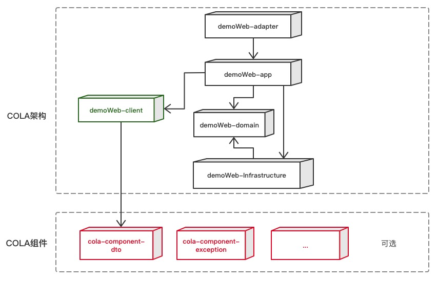
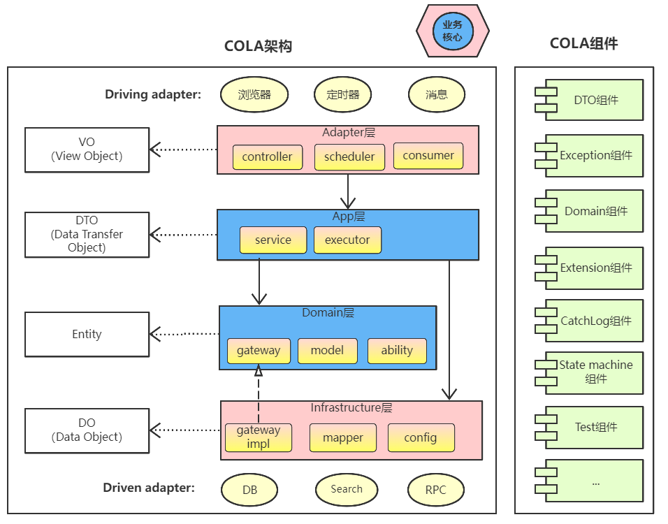

项目整体采用COLA架构，目录结构关系如下图：

参考如下：https://blog.csdn.net/significantfrank/article/details/110934799

1）适配层（Adapter Layer）：负责对前端展示（web，wireless，wap）的路由和适配，对于传统B/S系统而言，adapter就相当于MVC中的controller；

2）应用层（Application Layer）：主要负责获取输入，组装上下文，参数校验，调用领域层做业务处理，如果需要的话，发送消息通知等。层次是开放的，应用层也可以绕过领域层，直接访问基础实施层；

3）领域层（Domain Layer）：主要是封装了核心业务逻辑，并通过领域服务（Domain Service）和领域对象（Domain Entity）的方法对App层提供业务实体和业务逻辑计算。领域是应用的核心，不依赖任何其他层次；

4）基础实施层（Infrastructure Layer）：主要负责技术细节问题的处理，比如数据库的CRUD、搜索引擎、文件系统、分布式服务的RPC等。此外，领域防腐的重任也落在这里，外部依赖需要通过gateway的转义处理，才能被上面的App层和Domain层使用。